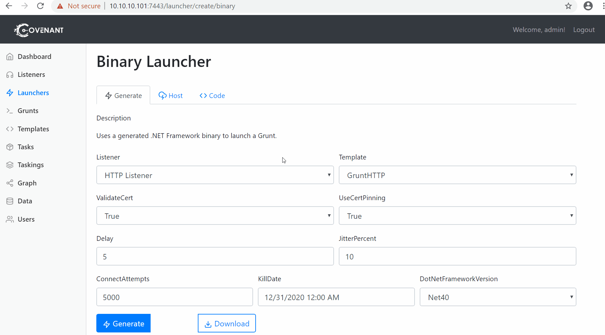
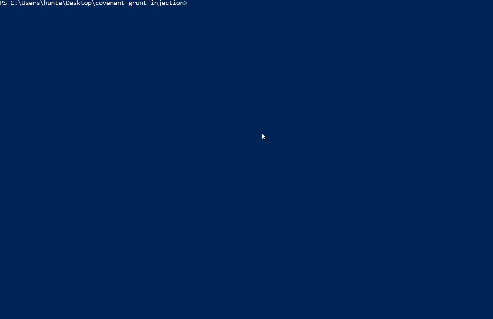
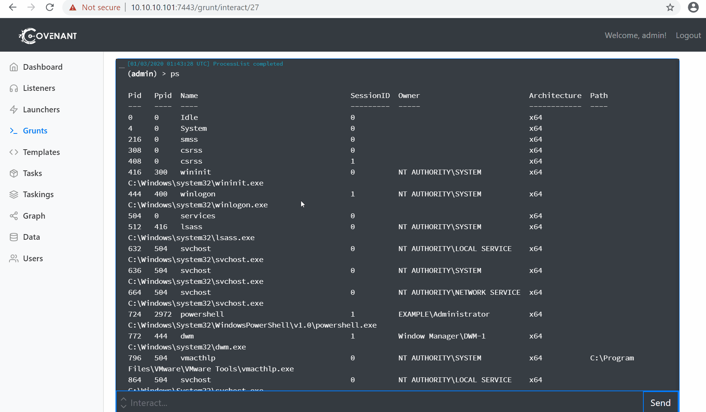
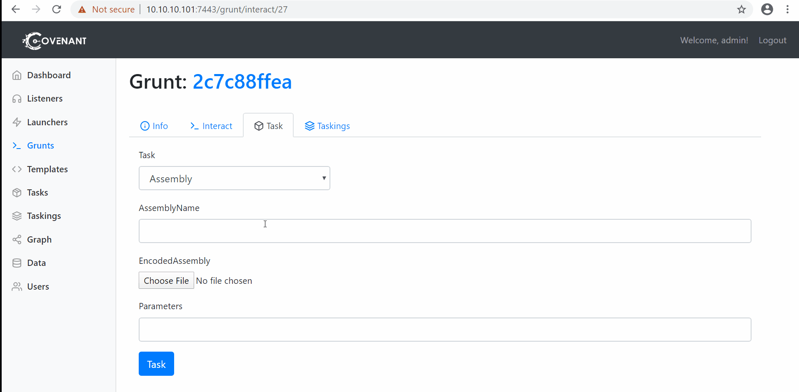
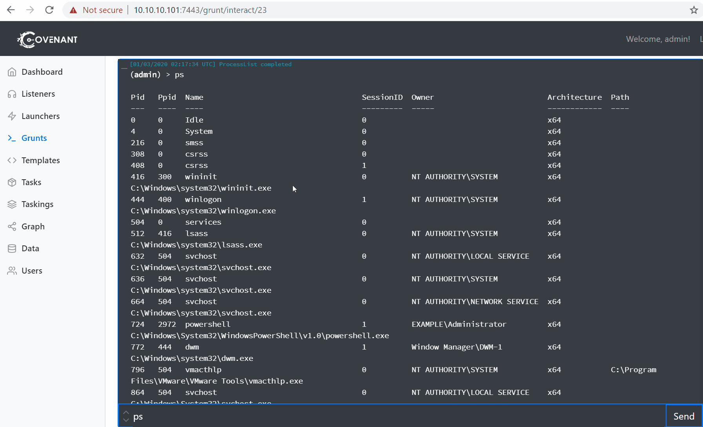

# covenant-grunt-injection# Generate-GruntInjector

A PowerShell script that turns a Covenant Grunt launcher into a .NET assembly that can be coupled with Covenant's Assembly command to achieve process injection in Covenant.

## Installation / Getting started

The script relies on [Donut](https://github.com/TheWover/donut) to convert the Grunt launcher .NET assembly into shellcode. Follow their installation and compilation instructions and ensure donut.exe is either in your PATH or note its path.

Clone this repository.

```shell
git clone https://github.com/tgihf/covenant-grunt-injection.git
```

The script uses `csc.exe` to compile the Grunt injector. If you'll be targeting machines with `csc.exe` for .NET 3.5, make sure you have .NET 3.5 installed. If you'll be targeting machines with csc.exe for .NET 4.0 installed, make sure you have .NET 4.0 installed.

## Usage

> Scenario: you have a functional Grunt on a target machine and want to inject a Grunt into another process.

Host a Binary Launcher. Note the .NET Framework Version. 



Run `Generate-GruntInjector` with the URL the Binary Launcher is hosted on, the path to `donut.exe`, and the .NET Framework version the Binary Launcher is compiled against.



This produces a Grunt injector, which by default is named `GruntInjector_<timestamp>_v<.NET Framework version>.exe`. This .NET assembly injects a Grunt into an new, arbitrary process with an arbitrary PPID. 

Check which processes are running on the target with your functional grunt. I'll be using the PID of this `powershell.exe` process as my PPID.


  
Navigate to your functional Grunt's `Task` page and select the `Assembly` task.

Give it an arbitrary `AssemblyName`.

Set the `EncodedAssembly` parameter to your new Grunt injector.

For the `Parameters` parameter, give it the full path of the executable you'd like to inject into and the PPID you'd like to spoof.



Click `Task` and profit!



#### Argument 1
Type: `String`  
Default: `'default value'`

State what an argument does and how you can use it. If needed, you can provide
an example below.

Example:
```bash
awesome-project "Some other value"  # Prints "You're nailing this readme!"
```

#### Argument 2
Type: `Number|Boolean`  
Default: 100

Copy-paste as many of these as you need.

## Contributing

When you publish something open source, one of the greatest motivations is that
anyone can just jump in and start contributing to your project.

These paragraphs are meant to welcome those kind souls to feel that they are
needed. You should state something like:

"If you'd like to contribute, please fork the repository and use a feature
branch. Pull requests are warmly welcome."

If there's anything else the developer needs to know (e.g. the code style
guide), you should link it here. If there's a lot of things to take into
consideration, it is common to separate this section to its own file called
`CONTRIBUTING.md` (or similar). If so, you should say that it exists here.

## Links

Even though this information can be found inside the project on machine-readable
format like in a .json file, it's good to include a summary of most useful
links to humans using your project. You can include links like:

- Project homepage: https://your.github.com/awesome-project/
- Repository: https://github.com/your/awesome-project/
- Issue tracker: https://github.com/your/awesome-project/issues
  - In case of sensitive bugs like security vulnerabilities, please contact
    my@email.com directly instead of using issue tracker. We value your effort
    to improve the security and privacy of this project!
- Related projects:
  - Your other project: https://github.com/your/other-project/
  - Someone else's project: https://github.com/someones/awesome-project/


## Licensing

One really important part: Give your project a proper license. Here you should
state what the license is and how to find the text version of the license.
Something like:

"The code in this project is licensed under MIT license."